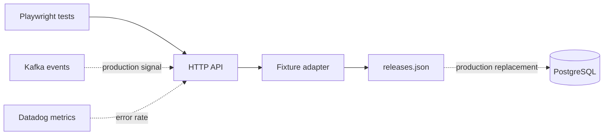

# Architecture

The runnable version uses deterministic JSON so the portfolio can be tested offline and in CI. The boundaries are intentionally explicit: the fixture adapter can be replaced by a PostgreSQL repository, while event coverage and error rate are documented extension points for Kafka and Datadog adapters in a production deployment. These integrations are not implemented in this showcase.

## Quality boundary

Playwright checks both the user-facing dashboard and the API contract. Its portfolio-integrity tests validate the fixture shape, API contract structure, persistence constraints, and container health configuration. PostgreSQL constraints in [`db/schema.sql`](../db/schema.sql) document the persistence invariants that should remain true when the adapter is introduced; they are not a live database integration test.